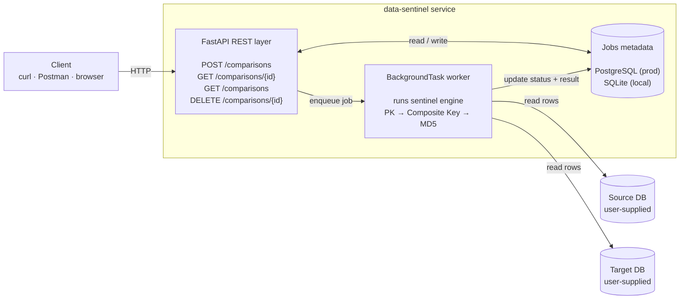

# data-sentinel


**Live demo:** [data-sentinel.onrender.com](https://data-sentinel.onrender.com) . 
**API docs:** [/docs](https://data-sentinel.onrender.com/docs)

> Open-source data validation service. Compare any two SQLAlchemy-compatible databases with a three-tier fallback strategy.

`data-sentinel` exposes both a Python CLI (Click) and a REST API (FastAPI) for verifying data integrity across database environments — useful during migrations, releases, and post-deploy validation.


## Try it now (no install needed)

The live demo is running on Render. Hit it directly:

\```bash
# Health check
curl https://data-sentinel.onrender.com/api/v1/health

# List recent comparison jobs
curl https://data-sentinel.onrender.com/api/v1/comparisons
\```

Or open the interactive Swagger UI: **[data-sentinel.onrender.com/docs](https://data-sentinel.onrender.com/docs)**

> **Note:** The free Render instance sleeps after 15 minutes of inactivity. First request after sleep takes ~30 seconds to wake up. After that, responses are sub-second.

---

## Why

I built the original engine while working at Amdocs, where my team needed to validate that data matched after every migration between Dev → UAT → Prod environments. Manual SQL spot-checks were slow, error-prone, and didn't scale to ~4M-row tables.

The internal version is now embedded in release pipelines used by 50+ engineers across multiple teams. `data-sentinel` is the open-source generalization — same comparison engine, same three-tier fallback strategy, but generalized to work across any SQLAlchemy-compatible database (PostgreSQL, Oracle, MySQL, SQLite) and packaged as both a CLI and a REST API.

---

## Features

- **Three-tier comparison strategy** with automatic fallback:
  1. **Primary Key** — fast set-based comparison when a single PK exists
  2. **Composite Key** — multi-column key when no single PK is defined
  3. **MD5 Row Hash** — content-based fingerprinting when no key is available
- **REST API** — submit jobs, poll status, fetch results
- **Async job orchestration** — long comparisons don't block API responses
- **Persistent job history** — jobs survive server restarts
- **Configurable WHERE-clause filters** — compare a subset of rows
- **Dual interface** — original Click CLI is still fully supported alongside the HTTP API
- **Containerized** — single Dockerfile for cloud deployment
- **Auto-generated OpenAPI docs** at `/docs`

---

## Architecture 



**Request lifecycle:**
1. Client `POST`s a comparison request → API persists a `queued` job in metadata DB → returns `202 Accepted` with `job_id`.
2. `BackgroundTask` picks up the job, marks it `running`, and runs the sentinel engine against the user-supplied source and target databases.
3. Engine picks the best comparison strategy (PK if available → composite key → MD5 row hash fallback) and writes the result back to the metadata DB.
4. Client polls `GET /comparisons/{job_id}` to retrieve the final result.


## Design Decisions

A few choices that aren't obvious from the code:

- **Three-tier fallback (PK → Composite Key → MD5):** Most comparison tools assume a primary key exists. Real-world databases often don't have one (legacy tables, denormalized warehouses, partial migrations). The fallback ensures `data-sentinel` works on any pair of tables, with the caller getting back the strategy used so they can interpret the result.

- **MD5 row hashing over SHA-256:** MD5 is faster and the use case is drift detection, not security. Hash collisions are operationally irrelevant here.

- **`BackgroundTasks` over Celery:** A comparison run is bounded and in-process. Adding Celery + Redis would be over-engineering for the current single-instance deployment. Migrating to Celery is on the roadmap if/when horizontal scaling matters.

- **Repository pattern with per-request session injection:** Keeps the API layer thin and makes the `JobStore` independently testable without spinning up FastAPI's dependency container.

- **PostgreSQL in production, SQLite locally:** SQLAlchemy abstracts both; the same code runs in either. SQLite gives a zero-setup local dev loop; PostgreSQL gives concurrent-write safety in production.


---

## Quick Start

### Prerequisites

- Python 3.9+

### Run Locally

```bash
git clone https://github.com/V-ishu/data-sentinel.git
cd data-sentinel

python -m venv venv
venv\Scripts\activate        # Windows
# source venv/bin/activate   # macOS / Linux

pip install -r requirements.txt
python scripts/seed_demo.py  # creates source.db & target.db with intentional differences
uvicorn app.main:app --reload
```

Open [http://localhost:8000/docs](http://localhost:8000/docs) in a browser.

Try `POST /api/v1/comparisons` with this body:

```json
{
  "source_db": "sqlite:///source.db",
  "target_db": "sqlite:///target.db",
  "table": "employees"
}
```

You'll get a `job_id` back. Then call `GET /api/v1/comparisons/{job_id}` to see the full diff.

**Sample response:**

```json

{
  "job_id": "8f3c1a9e-2b5d-4f7a-9c8e-1a2b3c4d5e6f",
  "status": "queued",
  "created_at": "2026-05-01T14:32:18.421Z"
}

```

A few seconds later, `GET /api/v1/comparisons/{job_id}` returns the full diff:

```json

{
  "job_id": "8f3c1a9e-2b5d-4f7a-9c8e-1a2b3c4d5e6f",
  "status": "completed",
  "table": "employees",
  "summary": {
    "strategy_used": "primary_key",
    "rows_in_source": 1024,
    "rows_in_target": 1019,
    "rows_only_in_source": 7,
    "rows_only_in_target": 2,
    "rows_with_differences": 14,
    "matching_rows": 1003
  },
  "started_at": "2026-05-01T14:32:18.500Z",
  "finished_at": "2026-05-01T14:32:21.892Z"
}

```

### CLI (Original)

```bash
python -m sentinel.cli compare \
  --source-db sqlite:///source.db \
  --target-db sqlite:///target.db \
  --table employees
```

---

## API Reference

| Method | Path | Purpose |
|--------|------|---------|
| `GET` | `/api/v1/health` | Liveness check |
| `POST` | `/api/v1/comparisons` | Submit a new comparison job (returns `202 Accepted` with `job_id`) |
| `GET` | `/api/v1/comparisons` | List recent jobs |
| `GET` | `/api/v1/comparisons/{job_id}` | Get job status and full result |
| `DELETE` | `/api/v1/comparisons/{job_id}` | Delete a job |

Interactive docs available at `/docs` (Swagger UI) and `/redoc` (ReDoc).

---

## Tech Stack

| Layer | Technology |
|-------|-----------|
| Language | Python 3.9+ |
| REST API | FastAPI + Uvicorn |
| ORM | SQLAlchemy 2.0 |
| Validation | Pydantic v2 + pydantic-settings |
| Database | PostgreSQL (production) / SQLite (local dev) |
| CLI | Click |
| Container | Docker |

---

## Project Structure

```
data-sentinel/
├── app/                    # FastAPI service layer
│   ├── api/v1/             # HTTP routes
│   ├── core/               # Config (pydantic-settings)
│   ├── db/                 # SQLAlchemy session + ORM models
│   ├── schemas/            # Pydantic request/response models
│   ├── services/           # Business logic + job orchestration
│   └── main.py             # FastAPI app entry point
├── sentinel/               # Original comparison engine + Click CLI
│   ├── comparator.py
│   ├── connector.py
│   ├── reporter.py
│   └── cli.py
├── scripts/
│   └── seed_demo.py        # Seeds demo SQLite DBs with intentional differences
├── Dockerfile              # Production container
├── requirements.txt
└── README.md
```

---

## Configuration

All config is read from environment variables or a local `.env` file.

| Variable | Default | Description |
|----------|---------|-------------|
| `DATABASE_URL` | `sqlite:///./data_sentinel.db` | SQLAlchemy connection URL for the metadata store |

See `.env.example` for the full format.

---

## Roadmap

- [x] FastAPI REST layer over the existing CLI engine
- [x] Persistent job storage with SQLAlchemy ORM
- [x] Async job orchestration via FastAPI BackgroundTasks
- [x] Env-driven configuration + Dockerfile for cloud deployment
- [x] Production deployment on Render
- [x] Pytest test suite + GitHub Actions CI
- [ ] Excel report download endpoint (currently CLI-only)
- [ ] Optional API key authentication
- [ ] Migrate background jobs to Celery for distributed workers

---

## License

MIT